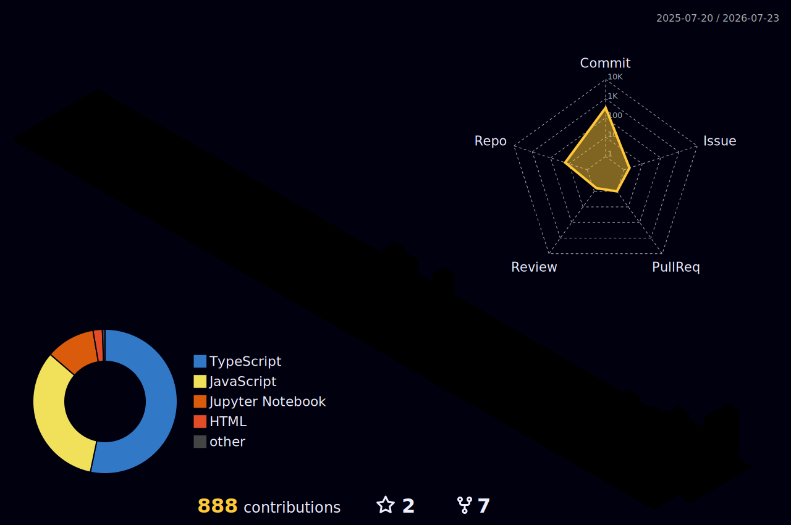

<!-- ═══════════════════════ ANIMATED HEADER ═══════════════════════ -->

  

<!-- ═══════════════════════ TYPING INTRO ═══════════════════════ -->

  

  
  

<!-- ═══════════════════════ TERMINAL BOOT ═══════════════════════ -->

  

<!-- LIVE:START -->

⚡ **Last commit:** 9 days ago in **bansal1806** · 👥 **1** followers · 📦 **18** public repos · 🕒 *updated 22 Jul, 09:15 am IST*

<!-- LIVE:END -->

<!-- ═══════════════════════ ABOUT ME ═══════════════════════ -->
#  About Me

<table>
<tr>
<td width="60%" valign="top">

-  **Currently Building:** [DevForge](https://github.com/bansal1806) — a next-generation GitHub-like platform with real-time collaboration and AI-powered insights
-  **Obsessed With:** AI integration, backend architecture & production-scale systems
-  **Learning Path:** Distributed systems, real-time infrastructure & DevOps scaling
- 🤝 **Open To:** Advanced full-stack, AI-driven & high-level system design collabs
- ⚡ **Fun Fact:** I don't just build projects — I design them as full-scale products with impact in mind

</td>
<td width="40%" align="center">
  
</td>
</tr>
</table>

<!-- ═══════════════════════ TECH STACK ═══════════════════════ -->
# 🛠️ Tech Arsenal

### 🌐 Frontend & Design

### ⚙️ Backend & Systems

### 🗄️ Database, Cloud & DevOps

### 🤖 AI & Data Science

<!-- ═══════════════════════ GITHUB STATS ═══════════════════════ -->
# 📊 GitHub Universe

  
  

  

  

  

  

<!-- ═══════════════════════ 3D SKYLINE ═══════════════════════ -->
# 🏙️ My Commits as a 3D City

  

<!-- ═══════════════════════ PACMAN GAME ═══════════════════════ -->
# 🎮 Pac-Man Eats My Contributions

  <picture>
    <source media="(prefers-color-scheme: dark)" srcset="https://raw.githubusercontent.com/bansal1806/bansal1806/output/pacman-contribution-graph-dark.svg">
    <source media="(prefers-color-scheme: light)" srcset="https://raw.githubusercontent.com/bansal1806/bansal1806/output/pacman-contribution-graph.svg">
    
  </picture>

<!-- ═══════════════════════ FUN ZONE ═══════════════════════ -->
# 😄 Daily Dose of Dev

<!-- ROAST:START -->
> 🔥 **Claude's verdict on my last 24h of commits**:
>
> *"Warming up the roasting chamber... check back tomorrow morning!"*
<!-- ROAST:END -->

  

  

<!-- ═══════════════════════ TIC-TAC-TOE ═══════════════════════ -->
# 🎯 Play Tic-Tac-Toe Against My Bot — Right Here!

<!-- TTT:START -->

<table>
  <tr><td></td><td></td><td></td></tr>
  <tr><td></td><td></td><td></td></tr>
  <tr><td></td><td></td><td></td></tr>
</table>

**How to play (10 seconds):** 1️⃣ Click an empty square → 2️⃣ GitHub opens a pre-filled issue → 3️⃣ Just press **Create** — don't edit the title! → ♻️ Refresh this page ~30s later to see the bot's move.

*You are ❌, the bot is ⭕. Best played on desktop — the GitHub mobile app may not pre-fill the move.*

🧑 Humans **0** · 🤖 Bot **0** · 🤝 Draws **0** · 🎮 Games played **0**

<!-- TTT:END -->

<!-- ═══════════════════════ CONNECT ═══════════════════════ -->
# 🤝 Let's Connect

  
  
  

 

  

<!-- ═══════════════════════ ANIMATED FOOTER ═══════════════════════ -->

  

